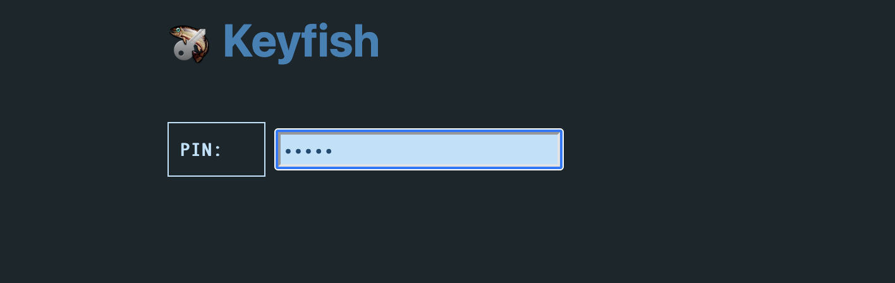
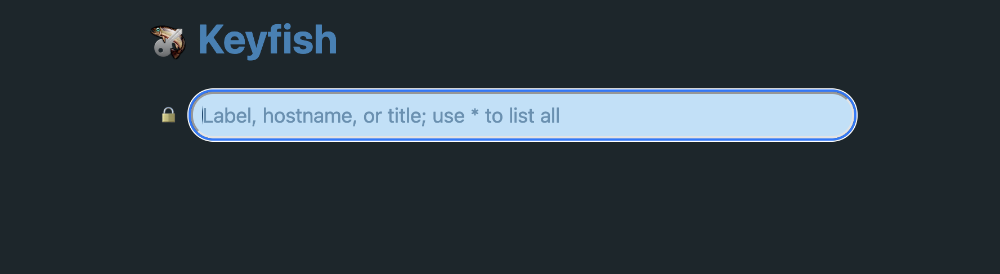
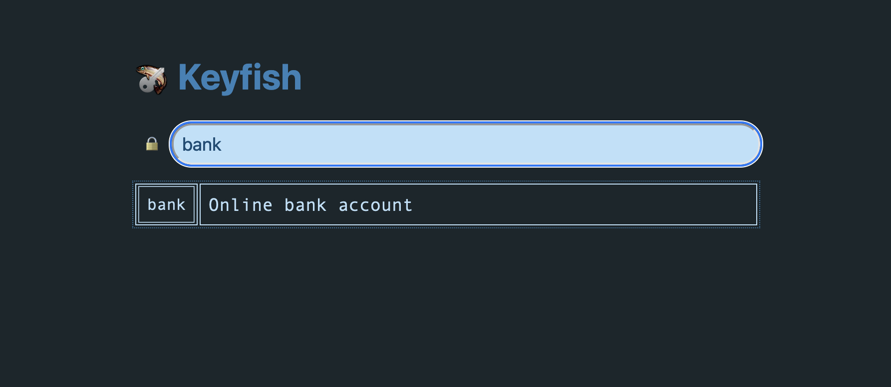
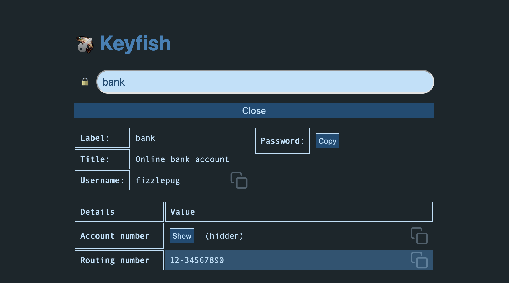
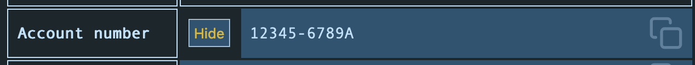

# Keyfish Web UI

To start the web UI, run `kf web`. In most cases, you will probably want to
enable a PIN lock to access the server, and have it auto-lock after some time:


```sh
kf web --addr localhost:8422 --pin abc123 --autolock 5m
```

The PIN is not a primary security measure, it just prevents someone who comes
across an unlocked screen on another machine from browsing your server.

When you visit the UI in the browser, you will be asked to enter the PIN:



Upon entering the correct PIN, you get a search box:



The search will narrow as you type, matching on names, titles, and other
non-secret details of the records in your database:



Once you have found the record you want, click or tab-enter on its name to open
a view of that record. By default, secret details are hidden:



Select the "Copy" button to copy the password to the clipboard, or click on any
of the highlighted copyable fields to do the same with their contents.

Some details may be hidden by default. Clicking the "(hidden)" annotation will
copy the underlying value to the clipboard, or you can use "Show" to reveal
the value directly:



Select "Close" at the top to close the view, or simply select the search bar
again to initiate a new search. Select the lock icon to explicitly lock the UI,
requiring the PIN to be re-entered before further use.
